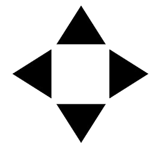
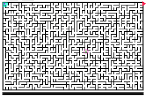

# Someways


## [Live Demo](https://nmenares.github.io/js_someways/)


## Background and Overview
SomeWays is a maze game where the user, using the arrow keys, has to move a ball to the exit point (top-right corner) within 60 seconds, passing for a green square.

The project is in JavaScript and the maze is created using [Random Transversal Algorithm](https://bl.ocks.org/mbostock/70a28267db0354261476).

## Technologies Used
* JavaScript/React.js
* HTML5
* CSS

## Main Technical Features

### Controllers
* New: Create a complete new maze, with the ball and green-square relocated. this is possible refreshing the page:
```js
  handleRefresh(e){
    e.preventDefault();
    location.reload();
  }

  <button onClick={this.handleRefresh.bind(this)}>New</button>
```
* Restart: The user always can try the same maze again, with the ball and green-square at the initial locations.

```js
 let outer  = document.getElementsByClassName('restart') [0];

 function handleRestart(e){
   e.preventDefault();
   game_over === true ? stop_prior_time = false : stop_prior_time = true;
   winner = false;
   timer = 0;
   eaten = 0;
   amount_of_food = 0;
   start = start_array[random_index];
   start_pos = [start_positions[random_index][0], start_positions[random_index][1]];
   food_copy = food.map (el => el);
   //remove all listeners
   window.removeEventListener("keydown", moveBall);
   window.removeEventListener("keydown", timerBar);
   outer.removeEventListener("click", handleRestart);
   //delete ball prints
   maze.cleanMaze();
   //Put ball in the original position
   ball.initialPosition(start_pos);
   //add green square and listeners
   setup();
 }

  outer.addEventListener("click", handleRestart);
```
```js
  //cleanMaze
  cleanMaze(){
    this.ctx.fillStyle = "#134667";
    this.ctx.fillRect(0, 0, this.width, this.height);
    this.cells.forEach((cell, idx) => {
      this.ctx.fillStyle = "#f0e6ef";
      this.fillCell(idx);
      ["S","E", "W", "N"].forEach(d => {
        if(d==="S" && (cell["S"] === true)) {
          this.ctx.fillStyle = "#f0e6ef";
          this.fillSouth(idx);
        } if (d==="E" && (cell["E"] === true)) {
          this.ctx.fillStyle = "#f0e6ef";
          this.fillEast(idx);
        }
      })
    })
  }
```

### Maze, Ball, Green-square and Exit arrow.

* The maze is represented by cells, which are the possible positions that the ball can take.
```js
toggleCell(index, direction) {
  if (!this.cells[index]) {
    this.cells[index] = { S: false, N: false, E: false, W: false };
  }
  this.cells[index][direction] = true;
}
```
* Each cell is represented by an object with the possible directions that the ball can take from that specific cell. Example: from the cell 123 the ball can go only to the North and South.
  * cells[123] === {N: true , E: false , S: true, W: false } # true
* The ball can go to any direction that the user indicates using key arrows, always if the direction value is true, that means that it is considering the black walls.
```js
if (e.keyCode === 37) { //west
  e.preventDefault();
  if(maze.cells[start]["W"] === true) {
    start = start - 1;
    ball.move( ball.pos[0] - (cellSize + cellSpacing), ball.pos[1]);
    if(food_copy.includes(start)) {
      amount_of_food += 1;
      food_counter();
      food_copy = food_copy.filter(el => el !== start);
      fillCell(start);
      ctx.fillStyle = "rgb(153, 105, 241)";
      ball.draw();
      eaten += 1;
    }
    if(start === ((width - cellSpacing)/(cellSize + cellSpacing))-1  && eaten === 1){
      youWin();
      window.removeEventListener("keydown", moveBall);
    } else if (start === ((width - cellSpacing)/(cellSize + cellSpacing))-1){
      ctx3.fillStyle = "#134667";
      ctx3.fillRect(0, 0, 400, 40);
      ctx3.fillStyle = "#f0e6ef";
      ctx3.textAlign = "center";
      ctx3.font = "20px monospace";
      ctx3.fillText(`Go to green square first!`, 200 , 30);
    }
  }
}
```