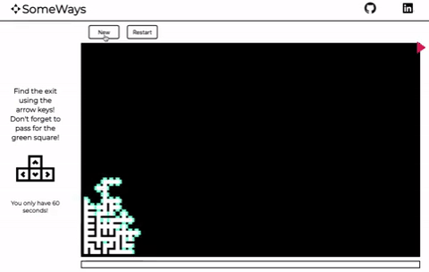
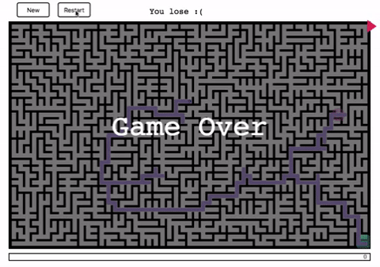
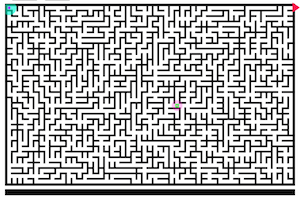
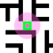
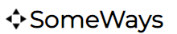

# Someways

## [Live Demo](https://nmenares.github.io/js_someways/)

## Background and Overview
SomeWays is a maze game where the user, using the arrow keys, has to move a ball to the exit point (top-right corner) within 60 seconds, passing for a green square.

The project is in JavaScript and the maze is created using [Random Transversal Algorithm](https://bl.ocks.org/mbostock/70a28267db0354261476).

## Technologies Used
* JavaScript/React.js
* HTML5
* CSS

## Main Technical Features

### Controllers
* New: Create a complete new maze, with the ball and green-square relocated.
* Restart: The user always can try the same maze again, with the ball and green-square at the initial locations.

### Maze, Ball, Green-square and Exit arrow.

* The maze is represented by cells, which are the possible positions that the ball can take.
* Each cell is represented by an object with the possible directions that the ball can take from that specific cell. Example: from the cell 123 the ball can go only to the North and South.
  * cells[123] === {N: true , E: false , S: true, W: false } # true
* The ball can go to any direction that the user indicates using key arrows, always if the direction value is true, that means that it is considering the black walls. The starting point could be in any corner, except for the top-right one, where the Exit is.
* Green-square is randomly set in the middle section of the maze. It is gone once the ball reaches that cell.

   =>     =>    

### timer

* The timer is set in 60 seconds. It the user complete the game within that time the user wins.
* The timer is initiated after the first click on one of the arrow keys.
* The timer stops once the user wins.

### Links

* My Github and Linkedin accounts.

* SomeWays title redirects to the Github page of the game.

### Messages
* The game starts with "Go to the green square!"
* When the user get the green-square, the message says "got to the Exit"
* After the user wins the message changes to "Congratulations, you win!"
* After the user loses the message changes to "You lose :("
