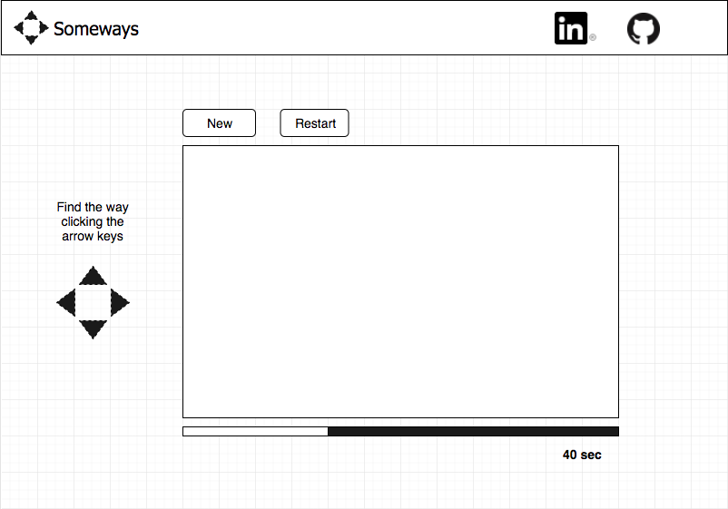

# Someways

## Background and Overview
Someways is a game where the user have to connect two objects, which are inside a labyrinth.

The labyrinth is created by an algorithm which generates a spanning tree of a two-dimensional rectangle grid. It means that only exist one way from the root in the bottom-left corner to every other cell in the maze.

By clicking the arrows, the user could move one of the 2 objects, the one that starts at the bottom-left corner, to find the other one that is near to the the opposite corner, diagonally. The user have to find the path within 1 minute.

## Functionality & MVP
In Someways, users will be able to:

- [X] Generate a new maze:
  - [X] An initial maze appropriate for the game.
  - [X] Create an initial ball that the user can manipulate by arrow keys.
  - [X] Look for a solution that considers the walls of the maze
- [X] Visualize how the maze is generated. Handle the canvas to show something specific if the user WINS or LOSES.
  - [X] Modify the Maze algorithm given to show how the maze is generated.
  - [X] Show GAME OVER on the canvas if the user loses.
  - [X] Show the final solution if the user wins.
- [X] Restart the same maze.
  - [X] Create functional controllers
- [X] Watch the timer.
  - [X] Add a timer to the page that the user can see all time.

## Wireframes

Someways consists of a single screen with the maze canvas, 2 control buttons (Start and Restart), an area with instructions, and a timer. Also, nav links to the Github and LinkedIn.

## Architecture and Technologies
This project will be implemented with the following technologies:

Vanilla JavaScript for overall structure and game logic.
HTML5 Canvas for DOM manipulation and rendering.
Webpack to bundle and serve up the various scripts.
In addition to the webpack entry file, there will be four scripts involved in this project:

someways.js: this script will handle the logic for creating and updating the necessary DOM elements.

maze.js: this script create the canvas and call maze_generator to create the labyrinth.

clock.js: this script has the timer details.

maze_generator.js: this script create the maze and generate the possible directions that the user can take (take care of the walls).

## Implementation Timeline
Over the weekend:
  Make a first version of canvas maze.

Day 1: Finish labyrinth logics and design:    From App Academy curriculum I got the algorithm to create a [Random Transversal Maze](https://bl.ocks.org/mbostock/70a28267db0354261476). In this first day I have to understand the logic of the maze to create one more appropriate for the JS Project, with the objective to create all necessary functions to make the object go through the maze (not passing walls).

Day 2: Place objects and movement logic for one of them: The object that is in bottom-left corner has to be moved by the user, when clicking the arrow keys. The object must not go through the walls of the maze.

Day 3: Make and design clock bar and add logics after win or lose. To make the game more interesting I would like to add a timer which limits the time of the user to get the ball until the next corner. Also, once the timer is done or the user reached the goal, these events have to happend:
  * WIN: Show the final solution (a line that connect both points)
  * LOSE: The canvas shows a big GAME OVER

Day 4: Navbar, controls, and design. At the end of this project I want to make the game prettier. That means, to make a Navbar with the information of the game and mine. Add buttons (controls) to Start or Restart a new maze.

Bonus features

Add sounds (clock, win and lose)
